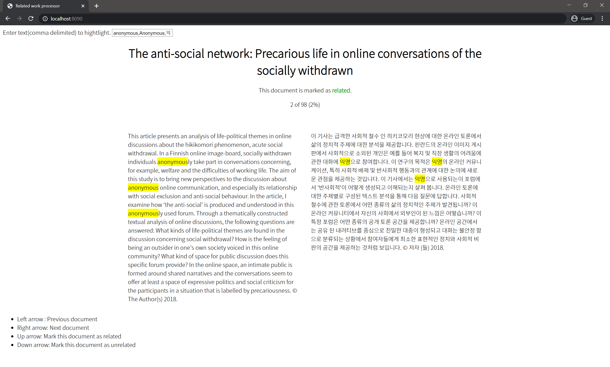

# Related Work Checker

본 연구는 선행 연구 리뷰를 할 때 무관한 논문들을 빠르게 제거할 수 있는 툴이다.

## 연구동기

연구를 시작하려면 먼저 선행 연구의 리뷰를 진행해야 한다. 그런데 SCOPUS등의 논문 검색 사이트에서 연구를 검색하면 검색어를 잘 설정한다 하더라도 수십 개에서 수백 개의 검색 결과가 나온다. 검색 필터를 더 설정하면 검색 결과를 줄일 수 있겠으나, 리뷰해야하는 논문을 놓칠 수 있다. 따라서 많은 수의 리뷰 논문을 빠르게 탐색할 수 있는 방법을 개발하고자 하였다.

본 프로젝트는 진행하는 연구가 이미 연구가 많이 이루어진 분야가 아니라, 초기 단계에 있는 분야임을 전제로 한다.

경험적으로, 논문을 키워드로 검색하였을 경우 연구가 별로 이루어지지 않은 분야라 할지라도 적어도 수백 개 이상의 논문이 검색된다. 그러나 이는 키워드는 매칭되지만, 맥락상 상당수가 진행하려는 연구와 무관한 것들이다. 따라서 완전히 무관한 논문들을 빠르게 걸러내기만 하더라도 검토해야 하는 논문의 수를 크게 줄일 수 있다.

따라서 선행 연구 리뷰를 빠르게 진행하고자, 무관한 논문들을 빠르게 제거할 수 있는 툴을 개발하기로 하였다.

## 구현 방법

선행 연구 리뷰를 할 때 어떤 문제점이 있는지를 먼저 고민하였다.

- 보통 영어 논문을 다루는데, 영어 독해가 익숙치 못하여 읽는 속도가 느리다.
- 보통 리뷰 매트릭스에는 논문 초고가 포함되지 않는다. 따라서 논문 초고 페이지와 리뷰 매트릭스를 오가는 데 시간이 든다.
- 논문을 검색하고 초고를 로딩하는 데 시간이 든다.
- 리뷰 매트릭스에 체크하는 데 시간이 든다.

 먼저 논문을 테이블 형식으로 표시하는 대신, 페이지에 논문의 제목과 초고만이 표시되도록 하고, 키보드 좌우 방향키를 사용하여 논문을 이동할 수 있도록 하였다. 왜냐하면 테이블 형식은 한 번에 여러 데이터를 보기 위하여 사용하는데, 리뷰 과정에서는 한 번에 두 개 이상의 논문을 볼 일이 없으므로 테이블 형식을 사용하는 것은 공간상 비효율적이기 때문이다. 그리고 논문이 진행하는 연구와 관련이 있는지 여부도 마찬가지로 키보드 상하 방향키를 사용하여 체크할 수 있도록 하였다. 그래서 논문을 살펴보는 것과 진행하는 연구와 관계된 논문을 체크하는 것을 방향키만으로 가능하도록 만들었다.

다음으로 논문 초고를 제시할 때 구글 번역기 API를 사용한 한글 번역본을 함께 제시하기로 하였다. 왜냐하면 영어 초고를 읽는 것보다 한글 초고를 읽는 편이 훨씬 빠른데, 비록 구글 번역기가 복잡한 영어 초고를 제대로 번역하지 못한다고는 하나 대강의 맥락은 충분히 확인할 수 있고, 이로부터 논문이 완전히 무관한지 여부를 쉽게 알 수 있기 때문이다.

마지막으로 논문의 특정 단어를 강조할 수 있도록 하였다. 왜냐하면 논문 검색 시 특정 키워드로 검색을 수행하였을 것인데, 그 키워드를 강조할 수 있다면 키워드가 어떤 문맥에서 쓰였는지 쉽게 파악이 가능하기 때문이다. 예컨대 `reply`라는 키워드는 `댓글`이라는 의미로 쓰일 수도 있고 `반응`이라는 의미로 쓰일 수도 있는데, 이 맥락만 파악하더라도 바로 관계없는 논문을 제거할 수 있기 때문이다.

그 외에 적당한 문단 너비, 폰트 크기, 폰트 종류 등을 조정하여 가독성을 극대화하도록 노력했다.

## 예시

위는 해당 프로그램을 실제로 사용한 모습이다. 원문과 번역본이 제시되며, 좌측 상단에서 설정한 특정 단어가 강조된다. 논문의 제목 밑에는 논문이 관계 있는지 관계 없는지 체크한 결과가 나타나며, 상하 방향키를 눌러서 체크 여부를 바꿀 수 있다. 위쪽 방향키를 누르면 관계된 것으로, 아래쪽 방향키를 누르면 무관한 것으로 체크한다. 보통 무관한 경우가 더 많아 기본값은 무관계한 것으로 설정하였다.

그 아래에는 작업 현황을 쉽게 알 수 있도록 현재 진행률이 표시되며, 좌측 하단에는 조작 방법을 간단히 제시하였다.

## 사용 방법

### 요구사항

- `Node.js` 10 이상의 버전
- `npm`혹은 `yarn`등 패키지 관리자
- `python3`
- `googletrans` 파이썬 라이브러리

### 실행 방법

1. 해당 프로젝트를 다운로드하거나 클론한다.
2. `SCOPUS`에서 `CSV`형식으로 검색 결과를 Export하여 프로젝트 폴더에 넣는다. 단, 논문 제목과 Abstract가 반드시 포함되어야 한다. 다른 컬럼들은 포함되지 않아도 된다.
3. `translate.py`파일을 실행하면 번역된 초고 컬럼이 추가된 `converted.csv`파일이 생성된다.
4. `converted.csv`를 `check.csv`로 바꾼다. 굳이 이렇게 한 이유는 파일을 덮어쓰는 일을 방지하기 위함이다.
5. `npm init` 혹은 `yarn init`커맨드를 입력하여 필요한 패키지들을 설치한다.
6. `node index.js`커맨드로 서버를 실행한다.
7. 커맨드라인에 표시되는 포트 번호로 접속한다. 기본값은 `http://localhost:8090`이다. 포트 번호는 `index.js` 파일의 상단에 상수로 정의되어있어 쉽게 바꿀 수 있다.